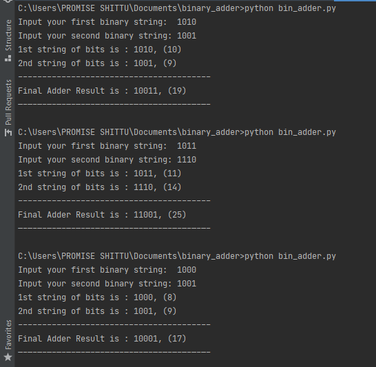

# ****Binary Adders****

Binary Adders are arithmetic circuits in the form of half-adders and fulladders used to add together two binary digits. 
A basic Binary Adder circuit can be made from standard AND and Ex-OR 
gates allowing us to “add” together two single bit binary numbers, A 
and B. 

The addition of these two digits produces an output called the SUM of 
the addition and a second output called the CARRY bit according to the 
rules for binary addition. One of the main uses for the Binary Adder is in 
arithmetic and counting circuits. 

The adding of binary numbers is exactly the same idea as that for 
adding together decimal numbers but this time a carry is only 
generated when the result in any column is greater or equal to “2”, the 
base number of binary. In other words 1 + 1 creates a carry. 

**Binary Addition** follows these same basic rules as for the denary 
addition above except in binary there are only two digits with the 
largest digit being “1”. So when adding binary numbers, a carry out is 
generated when the “SUM” equals or is greater than two (1+1) and this 
becomes a “CARRY” bit for any subsequent addition being passed over 
to the next column for addition and so on. 

##**A half adder**
A half adder is a logical circuit that performs an addition operation on 
two binary digits. The half adder produces a sum and a carry value 
which are both binary digits. 

##**A Full Adder Circuit** 
A full adder is a logical circuit that performs an addition operation on 
three binary digits and just like the half adder, it also generates a carry 
out to the next addition column. Then a Carry-in is a possible carry from 
a less significant digit, while a Carry-out represents a carry to a more 
significant digit.

_In many ways, the full adder can be thought of as two half adders 
connected together, with the first half adder passing its carry to the 
second half adder as shown._ 

The main difference between the Full Adder and the previous Half 
Adder is that a full adder has three inputs. The same two single bit data 
inputs A and B as before plus an additional Carry-in (C-in) input to 
receive the carry from a previous stage. 

###Code execution

`This is a laboratory exercise for Course code - CPE401 from the department of Computer Science and Engineering in Obafemi Awolowo University.`

